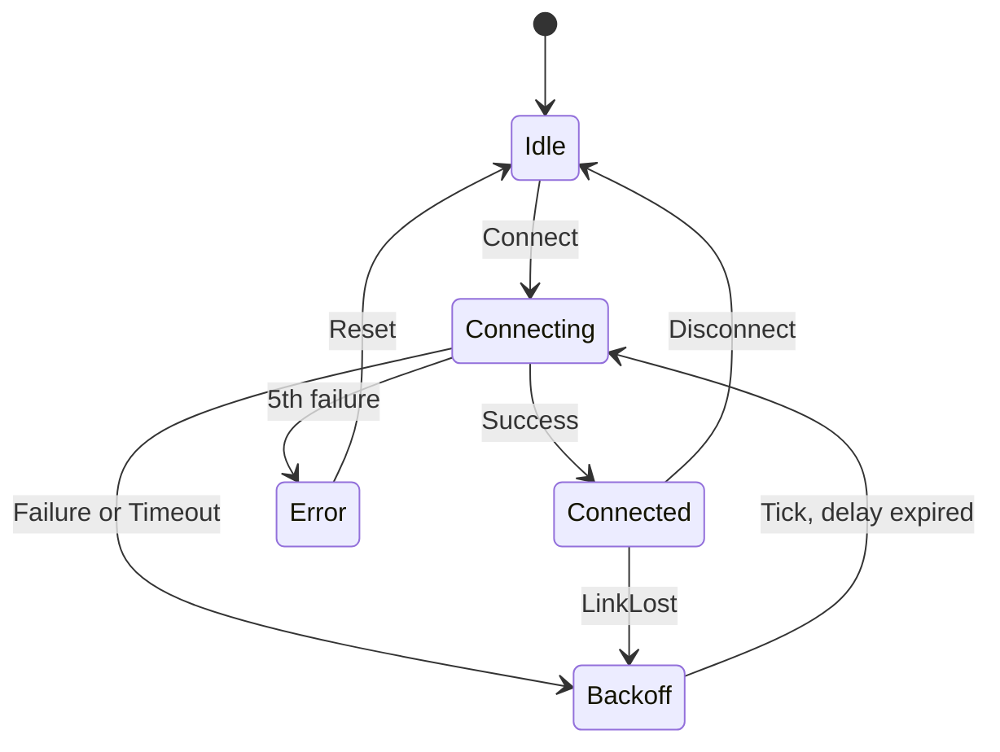

# Report

All five tasks use C++17 only. Every task builds with `-Wall -Wextra -Wpedantic -Werror` on GCC and Clang.
Tasks 1 to 4 also build with `-fno-exceptions -fno-rtti` and use no `new`, `std::vector`, `std::string`,
`std::function`, or `std::shared_ptr`.

## Task 1: Strong unit types

### Design
- `Quantity<Tag, Rep>` wraps one integer of type `Rep`.
- `Tag` is an empty struct. It exists only to make each unit a different type.
  `Quantity<MillivoltTag, int32_t>` and `Quantity<MilliampTag, int32_t>` are unrelated types.
- The constructor is `explicit`. So `Millivolts v = 5;` does not compile.
- There is no implicit conversion back to an integer. The only way out is `count()`.
- All operators are `constexpr` hidden friends. Each exists only for the exact same `Quantity` type.
  So mixing units has no matching operator, and the compiler stops.
- Operators: `+`, `-`, `*` by a plain number (both `q * 3` and `3 * q`), and all six comparisons.
- `static_cast<Rep>` is used inside operators. Small integers are promoted to `int` in arithmetic.
  The cast makes the narrowing back to `Rep` deliberate.

### Units
| Type | Rep | Why |
|---|---|---|
| `Millivolts` | `int32_t` | 4 bytes, as required |
| `Milliamps` | `int32_t` | wide enough for any current in mA |
| `Milliseconds` | `int32_t` | wraps after about 24.8 days. Task 3 uses a 64-bit time type instead. |
| `DeciCelsius` | `int16_t` | 253 means 25.3 C. Range is about -3276 C to +3276 C. |

### Literals
`3300_mV`, `20_mA`, and `250_ms`. They live in `fw::literals`.
Users opt in with `using namespace fw::literals;`.

### ADC conversion
`adc12_to_millivolts(std::uint16_t counts)` converts a 12-bit count to `Millivolts` with a 3.3 V reference.
- Formula: `counts * 3300 / 4095`, rounded to the nearest value, in integer arithmetic only:
  `(2 * c * 3300 + 4095) / (2 * 4095)`.
- Inputs above 4095 are clamped to 4095.
- The largest intermediate value is 27,027,000. It fits easily in `int32_t`.
- Full scale is taken as count 4095. Some chips use 4096. Check the datasheet.
- Examples: 0 gives 0 mV, 4095 gives 3300 mV, 2048 gives 1650 mV.

### Zero overhead
```cpp
static_assert(sizeof(Millivolts) == sizeof(std::int32_t));
```
The tag takes no space because it is a type, not a member.

### Compiler Explorer comparison
Source: `tests/asm_compare.cpp`.
```cpp
std::int32_t raw_fn(std::int32_t a, std::int32_t b) { return (a + b) * 3 - 5; }
Millivolts   qty_fn(Millivolts a, Millivolts b)     { return (a + b) * 3 - Millivolts{5}; }
```
Link: [https://godbolt.org/z/xo9WMMrcW](https://godbolt.org/z/xo9WMMrcW)

x86-64 GCC, `-O2`: both functions compile to the same three instructions.
```
add     edi, esi
lea     eax, [rdi-5+rdi*2]
ret
```
`-Os` also gives identical code for both functions.

ARM GCC, `-O2 -mcpu=cortex-m4 -mthumb`: both functions give the same instructions.
```
add     r0, r0, r1
add     r0, r0, r0, lsl #1
subs    r0, r0, #5
bx      lr
```

Result: with optimisation on, the Quantity wrapper vanishes. It costs nothing.

At `-O0` the two are not the same. The Quantity version calls its operators as separate functions.
Zero overhead needs optimisation. Firmware is normally built with `-O2` or `-Os`.

### Expressions that correctly fail to compile
Each one was checked with the compiler. All are rejected.
The same examples are in `tests/compile_fail_examples.cpp` inside an `#if 0` block.
```cpp
auto b1 = 3300_mV + 250_ms;           // different units: no operator+ accepts both
Millivolts b2 = 5;                    // the constructor is explicit
auto b3 = 3300_mV + 5;                // a plain int is not a Millivolts
bool b4 = (3300_mV == 20_mA);         // different units cannot be compared
void set_dac(Millivolts);
set_dac(250_ms);                      // wrong unit passed to a function
```

### Tests (6 test cases)
- Construct, read back, and default value is zero.
- Addition and subtraction.
- Scaling by a plain number, in both orders.
- All six comparisons.
- The three literals.
- ADC conversion: 0, 1, 2048, 4095, and a clamped value of 5000.

### Limitations
- `q * 2.5` compiles. The `2.5` is silently cut to `2`. A stricter design would delete the floating-point overloads.
- Signed overflow is undefined behaviour. The operators do not check for it.
- A literal that is too big is cut to the width of `Rep` without an error.
- There is no unit mixing such as volts times amps. It is deliberately not supported.

## Task 2: Compile-time register fields

### Design
- `Register<Address, Access, Storage>` is one 32-bit register.
  - `Address` is a template value. So the compiler knows it.
  - `Access` is `ReadOnly`, `WriteOnly`, or `ReadWrite`.
  - `Storage` is a policy. It has two static functions: `load(address)` and `store(address, value)`.
- `HwStorage` does a `volatile` read or write at the real address.
- In tests, `Sim` is the storage policy. It uses a plain array. So tests run on a PC.
- `Field<Reg, Offset, Width, Value>` is a bit field inside a register.
  - The mask is computed at compile time.
  - `read()` returns the field shifted down to bit 0.
  - `write(v)` is a read-modify-write. Only the field's bits change.
  - `set()` and `clear()` are for 1-bit fields only.
- `Value` is the type callers use. For multi-bit fields it is an `enum class`, for example `GpioMode`.
  So `Pin5Mode::write(1)` does not compile.
- `write(v)` cuts the value to the field width. A value that is too big cannot spill into the next field.

### Compile-time checks
| Rule | How it is enforced |
|---|---|
| Offset + width must be at most 32 | `static_assert` in `Field` |
| Width must be at least 1 | `static_assert` in `Field` |
| No write to a read-only register | `static_assert` in `Register::write` |
| No read of a write-only register | `static_assert` in `Register::read` |
| `set()` and `clear()` only for 1-bit fields | `static_assert` |
| A raw integer is not accepted for an enum field | normal overload resolution |

A field calls `Register::read` and `Register::write`. So a field of a read-only register is rejected through them.

### Expressions that correctly fail to compile
Each one was checked with the compiler. All are rejected.
The same examples are in `tests/compile_fail_examples.cpp` inside an `#if 0` block.
```cpp
using RwReg = Register<0x40020000, Access::ReadWrite>;
using RoReg = Register<0x40020004, Access::ReadOnly>;
using WoReg = Register<0x40020008, Access::WriteOnly>;
using Pin5Mode = Field<RwReg, 10, 2, GpioMode>;

constexpr auto m = Field<RwReg, 30, 4>::mask;      // 30 + 4 = 34 bits: overflows 32
RoReg::write(1);                                    // write to read-only register
Field<RoReg, 0, 1>::set();                          // field write to read-only register
auto v = WoReg::read();                             // read of write-only register
Pin5Mode::write(1);                                 // raw int, not GpioMode
Pin5Mode::set();                                    // set() on a 2-bit field
```

### Tests (6 test cases)
- Register read and write go through the storage policy.
- The field mask is computed at compile time.
- A field write changes only its own bits.
- A field read returns the shifted value, including a read-only register.
- `set()` and `clear()` change a single bit.
- An oversized value is cut off and cannot spill into neighbours.

### Compiler Explorer comparison
Source: `tests/asm_compare.cpp`.
`field_version()` calls `Pin5Mode::write(GpioMode::Output)`.
`handwritten_version()` does `*r = (*r & ~(0x3u << 10)) | (0x1u << 10)` on a `volatile` pointer.

Link: [https://godbolt.org/z/3bozdzeWa](https://godbolt.org/z/3bozdzeWa)

x86-64 GCC, `-O2` (also `-Os`). Both functions give the same instructions:
```
mov     eax, DWORD PTR ds:1073872896
and     ah, -13
or      ah, 4
mov     DWORD PTR ds:1073872896, eax
ret
```

ARM GCC, `-O2 -mcpu=cortex-m4 -mthumb`: both functions give the same instructions.
```
ldr     r2, .L3
ldr     r3, [r2]
bic     r3, r3, #3072
orr     r3, r3, #1024
str     r3, [r2]
bx      lr
.L3:
        .word   1073872896
```

Result: with optimisation on, the field write costs nothing extra.
It is one load, one change of the bits, and one store.

At `-O0` the field version is not the same. It calls `Field::write`, `Register::read`,
and `HwStorage::load` as separate functions. The zero-overhead result needs `-O2` or `-Os`.

### Limitations
- A field write reads the register, changes bits, and writes it back.
  An interrupt that changes the same register between the read and the write can lose an update.
  Real code must disable interrupts or use hardware bit-set and bit-clear registers.
- Some registers change when read, or use "write 1 to clear" bits.
  This design does not model those registers.
- Every register is 32 bits wide. 8-bit and 16-bit registers are not modelled.
- Values that are too big are cut off silently in `write()`.

## Task 3: Connection manager state machine

### Design
- Each state is its own struct. It holds only the data it needs.
  - `Idle` has no data.
  - `Connecting{attempt}`, `Connected{since}`, `Backoff{until, failures}`, `Error{code}`.
- The machine holds one `std::variant` of the five states.
- Events are also a `std::variant`: Connect, Success, Failure, Timeout, LinkLost, Disconnect, Reset, and Tick{now}.
- One `std::visit` handles a (state, event) pair. It uses the "overloaded lambdas" pattern.
  - Each valid transition is one lambda.
  - One generic lambda catches every other pair. It logs the event as ignored and keeps the state.
- Every state and event has a `name` string. The logger receives these two names.
  No strings are built. Only pointers to string literals are used.
- Time is injected through the `IClock` interface. Tests use a `FakeClock` and advance time instantly.
- Ignored events are reported through the `ILogger` interface.
- Time uses `Quantity<MillisecondTag, std::int64_t>` from Task 1.
  A 32-bit millisecond counter wraps after about 24.8 days. The 64-bit counter cannot overflow in practice.

### State diagram


### Backoff rules
- The delay doubles: 1 s, 2 s, 4 s, 8 s. The cap is 30 s.
- With a limit of 5 failures, the delay never gets above 8 s. The cap is tested on the function `backoff_delay` directly. Failure 6 gives 30 s.
- Entering Backoff counts one more consecutive failure. The fifth failure goes to Error instead.
- Success resets the count.

### Decisions on unclear points
1. **The "5th failure" arrow.** Figure 1 draws it from Backoff to Error. The text says to go to Error instead of entering Backoff. I followed the text. The fifth failure goes straight from Connecting to Error. So Backoff never holds a count of 5.
2. **Disconnect.** Figure 1 shows it only from Connected. In every other state it is ignored and logged.
3. **Failure count without a counter.** `Connecting{attempt}` already holds it. Attempt n failing means n failures in a row. Success resets it because `Connected` stores no count.
4. **LinkLost** counts as the first failure.
5. **Tick.**
   - A Tick before the deadline in Backoff is handled. It is not logged.
   - A Tick exactly at the deadline counts as expired.
   - A Tick in any other state is ignored and logged.

### Tests (10 test cases)
Every arrow in Figure 1 has a test.

| Arrow | Test |
|---|---|
| Idle to Connecting | Connect gives attempt 1 |
| Connecting to Connected | Success stores the clock time in `since` |
| Connecting to Backoff | Failure and Timeout each give `until = now + 1 s`, failures 1 |
| Backoff to Connecting | an early tick does nothing, a tick at the deadline gives attempt + 1 |
| Connected to Backoff | LinkLost gives failures 1 |
| Connected to Idle | Disconnect |
| Backoff to Error (5th failure) | delays 1, 2, 4, 8 s checked, then Error. The 30 s cap is checked too. |
| Error to Idle | Reset |

Other tests:
- Success resets the failure count.
- Ignored events: Success and Failure in Idle, and Connect in Connected.
  They change nothing, and the logger gets the right state and event names.

### Limitations
- The interfaces `IClock` and `ILogger` use virtual calls. This cost is small. It happens once per event.
- Nothing stops a caller from passing a Tick with a time that goes backwards. The clock is trusted.
- Disconnect does not cancel a retry while Connecting or in Backoff. This follows Figure 1.

## Task 4: CRTP versus virtual sensor drivers

### Design
- Both designs have the same three functions: init(), read(), name().
- read() returns std::optional<Sample>. It is empty if the sensor is not initialised.
- Virtual version: abstract class ISensor with three virtual functions.
- CRTP version: SensorBase<Derived> calls Derived::do_init(), do_read(), do_name().
- Both versions use the same mock behaviour classes. So both do exactly the same work.
  The benchmark measures only the cost of the call.
- The virtual benchmark gets its sensors from a function in another .cpp file.
  Otherwise the compiler sees the real type and removes the virtual call.
- The benchmarks print a checksum. The script checks that both checksums match.

### Results (-Os, best of 5 runs, g++ 15.2.0, 12th Gen Intel(R) Core(TM) i7-12700H)

| Version | text (B) | data (B) | bss (B) | 10M read() calls | ns per call |
|---------|---------:|---------:|--------:|-----------------:|------------:|
| virtual |   2461   |   736    |    8    |      71.6 ms     |    7.16     |
| CRTP    |   1778   |   616    |    8    |      16.1 ms     |    1.61     |

### What the numbers show
- The virtual loop makes an indirect call through the vtable on every read.
  The disassembly shows "call *0x8(%rax)".
- The CRTP loop has no call to read(). The compiler inlines it.
- Part of the speed gap comes from inlining, not only from the missing vtable lookup.
- Each virtual object also holds a vptr. A test checks this.
- Each virtual class has one vtable in read-only memory.

### When to choose each
Virtual:
- The set of drivers is open or decided at run time.
- You need one list that holds different sensors.
- You want a stable interface that hides the implementation.
- Cost: a vptr per object, a vtable per class, no inlining.

CRTP:
- The driver type is known at compile time, for example one fixed board.
- You want the smallest and fastest code.
- Cost: no mixed list, more code per type, harder error messages.

Heterogeneous list of sensors:
- Virtual: a simple array of ISensor*. The test does this.
- CRTP: the types differ, so one array cannot hold them.
- For a fixed set of types, std::variant with std::visit also works. It is static dispatch.

### Tests (6 test cases)
- Virtual: a list of two different sensors through `ISensor*`.
- CRTP: concrete sensors.
- Virtual and CRTP: `read()` before `init()` gives an empty optional.
- Both designs give the same readings.
- A virtual sensor is bigger than a CRTP sensor, because of the vptr.

### Caveats
- Sizes are for whole executables. Startup and library code are included.
  Only the difference between the two rows is meaningful.
- On a real target, compile the code for the target and size the object files:
  arm-none-eabi-g++ -Os -mcpu=cortex-m4 -mthumb -c ... then arm-none-eabi-size.
- Timing depends on the CPU and the compiler. Run it several times.

## Task 5: Thread-safe event bus

### Design decisions
- All storage lives inside the EventBus object. No heap is used.
- The queue is a ring buffer of QueueDepth events. An event is 8 bytes.
- A callback is a function pointer plus a void* context. There is no std::function.
- Two mutexes protect the shared state: one for the queue, one for the subscriber table.
  They are never held together, so lock-order deadlock cannot happen.
- publish() locks the queue mutex, copies one event, and unlocks.
  If the queue is full, it returns false. It never waits for callbacks.
- dispatch() takes one event out of the queue under the lock, then calls the matching callbacks.
  It is called from one consumer thread only.
- Callbacks run while the subscriber lock is held. So after unsubscribe() returns,
  the callback is never called again. A callback may call publish(),
  because publish uses the other mutex.
- A handle is the index of the subscriber slot.

### Tests (6 test cases)
- Events reach only the subscribers of that event id.
- Events arrive in order, also after the ring buffer wraps around.
- publish returns false when the queue is full.
- unsubscribe stops delivery.
- subscribe fails when every slot is used, or the callback is null.
- Stress test: 4 producer threads publish 100,000 events each. One consumer thread dispatches.
  - Each event carries (producer, sequence number). The consumer counts each pair in a table.
  - Result: all 400,000 events were delivered exactly once.
  - When the queue is full, a producer calls publish again until it succeeds.

### Limitations
- publish() waits for a mutex. The lock is held only to copy one event,
  but this is not a hard real-time guarantee.
- A callback must not call subscribe() or unsubscribe(). The subscriber lock is already held.
- A long callback delays subscribe() and unsubscribe(). It does not delay publish().
- dispatch() must be called from one thread only. This is not checked.
- A handle is only a slot index. After unsubscribe, a second unsubscribe with the same handle
  could remove a newer subscriber that reused the slot.
- std::mutex is not safe in an interrupt handler. A lock-free queue would be needed there.
- A full queue drops the new event. Other designs overwrite the oldest or block.

## Sanitizer output

Both runs build and test all five tasks.

**ASan + UBSan** (`cmake -S . -B build-asan -DSANITIZE=address,undefined`):
```
Test project /home/bashitha/embedded-intern-assignment---modern-cpp-for-firmware/build-asan
    Start 1: task1
1/5 Test #1: task1 ............................   Passed    0.03 sec
    Start 2: task2
2/5 Test #2: task2 ............................   Passed    0.01 sec
    Start 3: task3
3/5 Test #3: task3 ............................   Passed    0.02 sec
    Start 4: task4
4/5 Test #4: task4 ............................   Passed    0.02 sec
    Start 5: task5
5/5 Test #5: task5 ............................   Passed    0.54 sec

100% tests passed, 0 tests failed out of 5
```

**ThreadSanitizer** (`cmake -S . -B build-tsan -DSANITIZE=thread`):
```
Test project /home/bashitha/embedded-intern-assignment---modern-cpp-for-firmware/build-tsan
    Start 1: task1
1/5 Test #1: task1 ............................   Passed    0.02 sec
    Start 2: task2
2/5 Test #2: task2 ............................   Passed    0.02 sec
    Start 3: task3
3/5 Test #3: task3 ............................   Passed    0.02 sec
    Start 4: task4
4/5 Test #4: task4 ............................   Passed    0.02 sec
    Start 5: task5
5/5 Test #5: task5 ............................   Passed    4.00 sec

100% tests passed, 0 tests failed out of 5

Total Test time (real) =   4.09 sec
```

## C++20 features used
None. The code uses C++17 only.

## Acknowledgements and Learning Journey
I would like to conclude by noting that this assignment was a significant learning experience. Coming from a background where my formal programming experience was primarily in Python and Java, navigating the intricacies of modern C++ for firmware was a new challenge. To support my learning curve and help structure the code effectively, I transparently leveraged AI tools, including Claude and Gemini Pro. This approach allowed me to not only complete the technical requirements but also genuinely learn and adopt modern C++ best practices.